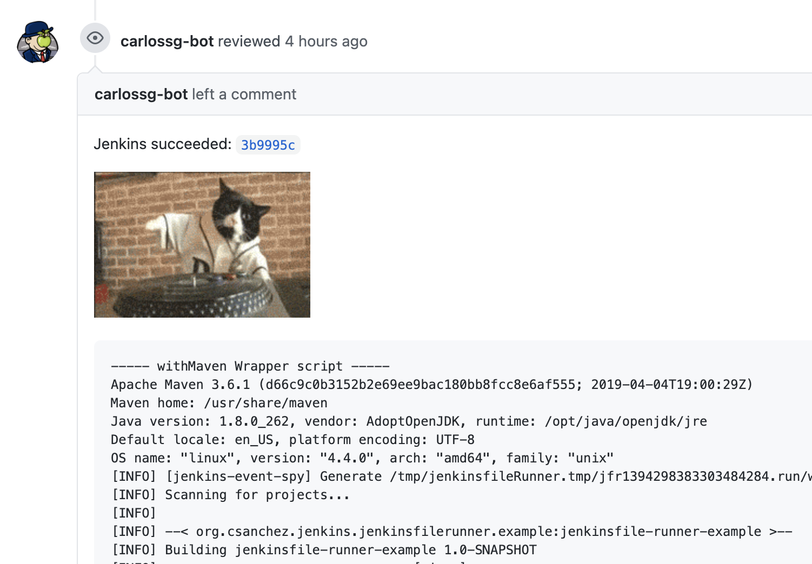
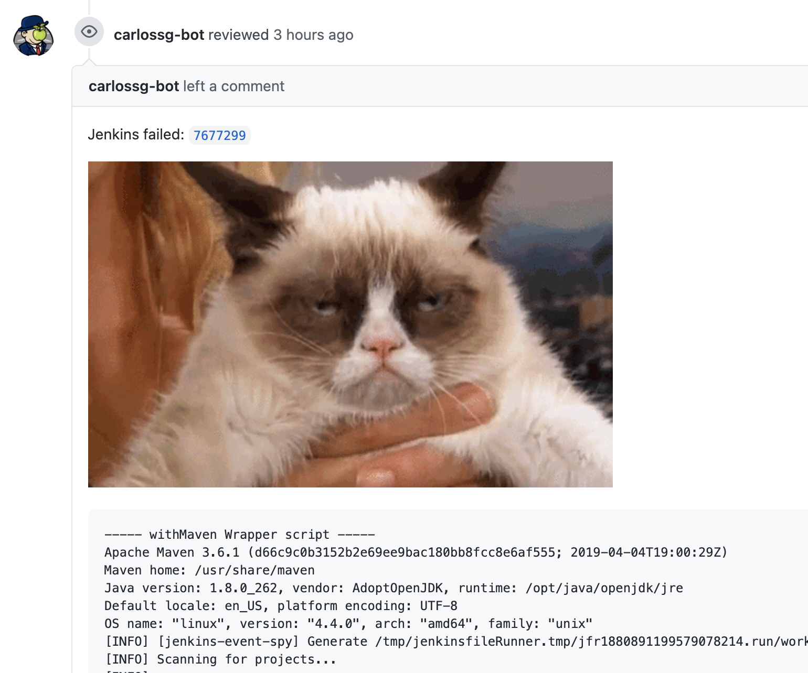

# Jenkinsfile Runner for Google Cloud Run


A [Google Cloud Run](https://cloud.google.com/run) (a container native, serverless platform) Docker image to run Jenkins pipelines. It will process a GitHub webhook, git clone the repository and execute the Jenkinsfile in that git repository. It allows high scalability and pay per use with zero cost if not used.

This image allows `Jenkinsfile` execution without needing a persistent Jenkins master running in the same way as Jenkins X Serverless, but using the Google Cloud Run platform instead of Kubernetes.

# Google Cloud Run vs Project Fn vs AWS Lambda

I wrote three flavors of Jenkinsfile Runner

* [Google Cloud Run](https://github.com/carlossg/jenkinsfile-runner-google-cloud-run)
* [AWS lambda](https://github.com/carlossg/jenkinsfile-runner-lambda)
* [Project Fn](https://github.com/carlossg/jenkinsfile-runner-fn)

The image is similar to the other ones. The main difference between Lambda and Google Cloud Run is in the packaging, as Lambda layers are limited in size and are expanded in `/opt` while Google Cloud Run allows any custom Dockerfile where you can install whatever you want in a much easier way.

This image is extending the Jenkinsfile Runner image instead of doing a Maven build with it as a dependency as it simplifies classpath magement.


# Limitations

Max build duration is 15 minutes but we can use a timeout value up tos 60 minutes by using `gcloud beta`.

Current implementation limitations:

* `checkout scm` does not work, change it to `sh 'git clone https://github.com/carlossg/jenkinsfile-runner-example.git'`

# Example

See the [jenkinsfile-runner-example](https://github.com/carlossg/jenkinsfile-runner-example) project for an example.

When the PRs are built Jenkins writes a comment back to the PR to show status, as defined in the Jenkinsfile, and totally customizable.





Check the PRs at [carlossg/jenkinsfile-runner-example](https://github.com/carlossg/jenkinsfile-runner-example/pulls)


# Extending

You can add your plugins to `plugins.txt`.
You could also add the Configuration as Code plugin for configuration, example at `jenkins.yaml`.

Other tools can be added to the `Dockerfile`.

# Installation

GitHub webhooks execution will time out if the call takes too long, so we also create a nodejs Google function (`index.js`) that forwards the request to Google Cloud Run and returns the response to GitHub while the build runs.

## Building

Build the package

```shell
mvn verify
docker build -t jenkinsfile-runner-google-cloud-run .
```

## Publishing

Both the function and the Google Cloud Run need to be deployed.

Set `GITHUB_TOKEN_JENKINSFILE_RUNNER` to a token that allows posting PR comments.
A more secure way would be to use Google Cloud Secret Manager.

```shell
export GITHUB_TOKEN_JENKINSFILE_RUNNER=...

PROJECT_ID=$(gcloud config get-value project 2> /dev/null)

make deploy
```

Note the function url and use it to create a GitHub webhook of type `json`.

## Execution

To test the Google Cloud Run execution

```shell
URL=$(gcloud run services describe jenkinsfile-runner \
    --platform managed \
    --region us-east1 \
    --format 'value(status.address.url)')
curl -v -H "Content-Type: application/json" ${URL}/handle -d @src/test/resources/github.json
```

## Logging

```shell
gcloud logging read "resource.type=cloud_run_revision AND resource.labels.service_name=jenkinsfile-runner" \
    --format "value(textPayload)" --limit 100
```

or

```shell
gcloud alpha logging tail "resource.type=cloud_run_revision AND resource.labels.service_name=jenkinsfile-runner" \
    --format "value(textPayload)"
```


## GitHub events

Add a GitHub `json` webhook to your git repo pointing to the Google Cloud Function url than you can get with

```shell
gcloud functions describe jenkinsfile-runner-function --format 'value(httpsTrigger.url)'
```

# Testing

The image can be run locally

```shell
docker run -ti --rm -p 8080:8080 -e GITHUB_TOKEN=${GITHUB_TOKEN_JENKINSFILE_RUNNER} jenkinsfile-runner-google-cloud-run
curl -v -H "Content-Type: application/json" -X POST http://localhost:8080/handle -d @src/test/resources/github.json
```

The function can be tested with curl

```shell
curl -v -H "Content-Type: application/json" \
  -X POST \
  $(gcloud functions describe jenkinsfile-runner-function --format 'value(httpsTrigger.url)') \
  -d @src/test/resources/github.json
```
